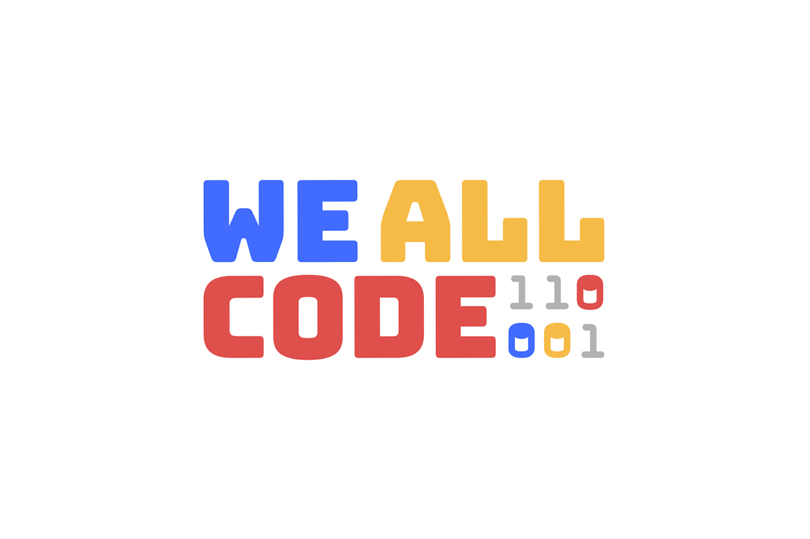

<!-- DO NOT MODIFY -->
# p5.js w/ We All Code

This repository contains the boilerplate needed to run a simple p5 project in [repl.it](https://replit.com) and has been created for [We All Code](https://www.weallcode.org/)

## More info on p5.js

p5.js is a JavaScript library for creative coding, with a focus on making coding accessible and inclusive for artists, designers, educators, beginners, and anyone else! p5.js is free and open-source because we believe software, and the tools to learn it, should be accessible to everyone.

[Check out the official docs here](https://p5js.org/reference/).

